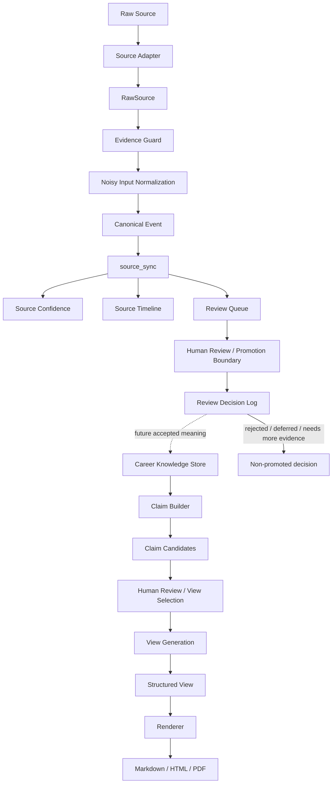

# Architecture

This document defines the structural boundaries and responsibilities behind me-shower.

Its purpose is to make clear where truth lives, what each layer is responsible for, and how Source Intelligence should be understood as a knowledge-shaping layer rather than a bundle of convenience importers.

## End-to-End Flow

```text
Raw Source
    ↓
Source Adapter
    ↓
RawSource
    ↓
Evidence Guard
    ↓
Noisy Input Normalization
    ↓
Canonical Event
    ↓
source_sync
    ↓
Review Queue
    ↓
Human Review
    ↓
Review Decision Log
    ↓
Career Knowledge Store
    ↓
Claim Builder
    ↓
Claim Candidates
    ↓
Human Review / View Selection
    ↓
View Generation
    ↓
Resume / Portfolio / Interview Story
```

The key rule in this flow is that Views such as Resume or Portfolio must not come first. Source is structured into reviewable Canonical Events, stored as candidates in `source_sync`, and passed through the Review / Promotion Boundary before Career Knowledge is grown. Only then are downstream Views generated and optionally rendered as formats such as PDF.

## v0.3.0 Source Intelligence Flow

```text
GitHub / Slack / Teams / Daily Report / File
    ↓
Source Adapter
    ↓
RawSource
    ↓
Source Normalizer
    ↓
Evidence Guard
    ↓
Noisy Input Normalization
    ↓
Canonical Event
    ↓
source_sync
    ↓
Source Confidence
    ↓
Source Timeline
```

This flow should not be interpreted as a list of import features. It is the current architecture for converting work traces into reviewable Career Knowledge candidates.

## Responsibility Boundaries

### Source Adapter

Receives source-specific inputs such as GitHub, Slack, Teams, Daily Reports, or files and converts them into a common `RawSource` shape.

### RawSource

Transient adapter output. It is a transport format for ingestion, not durable knowledge.

### Source Normalizer

Applies source-aware cleanup and interpretation so heterogeneous traces can be handled consistently downstream.

### Evidence Guard

Prevents unsafe raw text, secrets, private URLs, and sensitive internal information from flowing into long-term storage or generated outputs. This boundary must not be bypassed.

### Noisy Input Normalization

Converts messy, fragmentary, or ambiguous text into more usable candidate actions and events. Without this layer, downstream timeline and view quality becomes unstable.

### Canonical Event

A reviewable event produced after normalization. It is the main unit that allows Source to be inspected as a structured event rather than preserved as raw text.

### source_sync

`source_sync` is the Canonical Event Store.

In v0.3.0, it is the most source-of-truth-like internal layer, but it is still not identical to reviewed Career Knowledge. It stores normalized fact candidates, not final long-term knowledge.

### Source Confidence

An operational signal attached to Canonical Events that reflects source strength, evidence quality, and extraction stability. It supports review prioritization, not value judgment.

### Source Timeline

A derived operational view generated from `source_sync`. It is useful for inspecting the flow of events over time, but it must not replace the event store.

### Review Queue

A generated worklist derived directly from Canonical Events in `source_sync`. It displays review readiness, safe Evidence references, and semantic risks so a human can begin review. It is neither Career Knowledge nor a Promotion Decision Log, creates no decision status, and never mutates `source_sync`.

### Review Decision Log

An append-only durable history of Human Review decisions about Canonical Events. The Canonical Event reference is primary and a Review Queue `queue_id` is optional context. It does not mutate Source or Review Queue and does not create Career Knowledge; an `approved` record remains only a future promotion candidate in v0.4.0.

### Career Knowledge Store

The future durable source of truth for reviewed Career Knowledge, stored under `app/data/career_knowledge/`. It stores future `accepted_meaning` and safe, traceable Evidence references, not a complete Canonical Event or Review Decision Log record. In v0.4.0 only the directory and contract exist: approved decisions are not automatically persisted and no entries are created.

### Claim Builder

A future transformation layer that derives presentation candidates only from reviewed Career Knowledge, `accepted_meaning`, safe Evidence references, and a validated PromotionDecisionRecord. It cannot create or modify Career Knowledge and cannot use `source_sync`, Canonical Events, Review Queue items, Review Decision Log rows, or an `approved` decision alone as direct input. v0.4.0 defines only its boundary and contract; it creates no candidates.

### Claim Candidate

A generated expression candidate for possible View use. It is not Career Knowledge, Resume output, or a source of truth, and it requires Human Review or View Selection before use. `approved_for_view` is View-scoped permission, not promotion or persistence approval.

### Review / Promotion Boundary

The persistence gate between `source_sync` and Career Knowledge. It applies Promotion Criteria and requires Human Review before a Canonical Event can become durable knowledge. Source Confidence can prioritize and inform this review, but even `high` confidence cannot bypass it.

The boundary records one of `approved`, `rejected`, `deferred`, or `needs_more_evidence`. Only `approved` may flow into Career Knowledge. The other statuses retain the review outcome without treating the candidate as truth.

### Career Knowledge

Reviewed long-term knowledge built from Canonical Events and supporting evidence. This is the durable core the system is trying to grow.

### View Generation

A future projection layer that selects Career Knowledge and reviewed Claim Candidates approved for a specific View use, then generates Resume, Portfolio, Interview Story, or another purpose-specific View. `accepted_meaning` is available only through its Career Knowledge Entry. Safe Evidence references and PromotionDecisionRecords provide traceability or validation context only and cannot generate View text or resolve raw content.

It does not create or modify Career Knowledge, make Claim Candidates authoritative, or use `source_sync`, Review Decision Log rows, an approved decision alone, a PromotionDecisionRecord alone, or unreviewed Claim Candidates directly. It may transform reviewed meaning only without creating facts, causality, expanded contribution scope, or merged new meaning. Views are not sources of truth, Career Knowledge, or Claim Candidates, and their wording must never flow back into Career Knowledge. v0.4.0 defines only the View Generation boundary and contract; it implements no generation and creates no View output.

A target View type, Career Knowledge Entry reference, and purpose-specific permission are always required. Structural facts may come directly from Career Knowledge; generated claim text additionally requires a reviewed Claim Candidate. Transformations preserve attribution, contribution scope, numbers and units, time, qualifiers, uncertainty, causality, and semantic category. Approval cannot override safety, and missing or conflicting inputs fail closed rather than being inferred.

View Generation outputs a future structured View. A separate Renderer is responsible for Markdown, HTML, or PDF output and cannot change accepted meaning. Audit metadata remains separate from View content, and personal information is excluded unless governed by a separate explicit policy.

## Truth Boundary

This section defines what each layer is and is not. If these boundaries blur, downstream convenience tends to become upstream truth.

### Raw Source

External or local original material. It is input material, not long-term truth inside me-shower.

### RawSource

Transient adapter output. It is not durable knowledge.

### source_sync

The Canonical Event Store in v0.3.0. It accumulates Career Knowledge candidates, but it is not identical to reviewed Career Knowledge.

### Career Knowledge

Human-reviewed long-term knowledge. This is the main asset me-shower is meant to grow.

### Claim Candidate

A downstream presentation candidate derived from Career Knowledge. It is neither durable knowledge nor final View output.

### Source Timeline

A derived operational view generated from `source_sync`. It is not history itself.

It is distinct from `timeline_view`: Source Timeline inspects Canonical Events in `source_sync`, while `timeline_view` chronologically projects reviewed Career Knowledge without reading or rendering Source content.

### Resume / Portfolio

Views generated from Career Knowledge. They are not sources of truth.

### PDF

A render format, not a View type. A Resume View may be rendered as Markdown, HTML, or PDF.

### View

A purpose-specific projection downstream of Career Knowledge and reviewed Claim Candidates. It is neither Career Knowledge nor a Claim Candidate, and it cannot flow back into either layer.

### Skills

Operational knowledge for agents. Skills are not Career Knowledge itself.

## Mermaid View



## Source of Truth Layers

```text
Raw Source: external / local original
RawSource: transient adapter output
source_sync: canonical event store
Review / Promotion Boundary: human-reviewed persistence gate
Career Knowledge: reviewed long-term knowledge
Career Knowledge Store: durable store for accepted meaning; boundary only in v0.4.0
Claim Builder: future transformation from Career Knowledge to presentation candidates; contract only in v0.4.0
Claim Candidate: non-authoritative presentation candidate requiring review before View use
View Generation: future purpose-specific projection after Human Review / View Selection; boundary only in v0.4.0
View: non-authoritative generated projection that never flows back into Career Knowledge
Source Timeline: derived view
Resume: audience-specific view
PDF: rendered artifact
```

The key architectural rule is simple:

> Downstream views must not silently become upstream truth.

Resume and PDF are outputs. They are not where durable career knowledge should originate.

## v1.0.0 Consolidation Targets

v0.x prioritizes concept validation, so some implementation density is acceptable. v1.0.0 should reorganize the system around validated responsibility boundaries.

Candidate modules:

- `commands/`
- `services/`
- `domain/`
- `source_intelligence/`
- `career_knowledge/`
- `evidence/`
- `timeline/`
- `views/`

Expected consolidation topics:

- split `main.py`
- separate domain models
- isolate the Source Intelligence module
- isolate the Career Knowledge module
- isolate the view generation module
- introduce a review queue
- define a clearer persistence model
