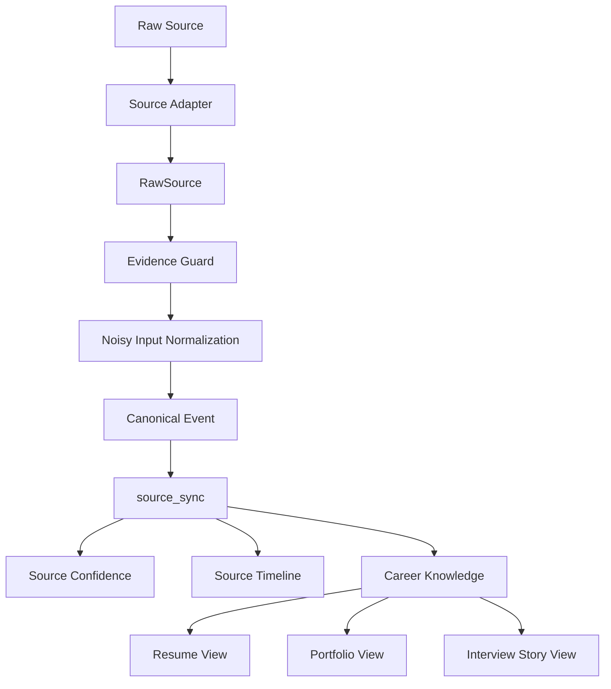

# Architecture

この文書では、me-shower の構造と責務境界を整理します。

目的は、「どこで何を確定させるのか」「どの層が何のためにあるのか」を日本語で読み直せるようにすることです。特に、Source Intelligence を便利な import 群ではなく、Career Knowledge を育てるための中核レイヤーとして位置づけます。

## End-to-End Flow

```text
Raw Source
    ↓
Source Adapter
    ↓
RawSource
    ↓
Evidence Guard
    ↓
Noisy Input Normalization
    ↓
Canonical Event
    ↓
source_sync
    ↓
Career Knowledge
    ↓
Views
```

この流れで重要なのは、Resume や PDF のような View を先に作らないことです。まず Source を整え、review 可能な Canonical Event として扱い、その先に Career Knowledge を育てます。

## v0.3.0 Source Intelligence Flow

```text
GitHub / Slack / Teams / Daily Report / File
    ↓
Source Adapter
    ↓
RawSource
    ↓
Source Normalizer
    ↓
Evidence Guard
    ↓
Noisy Input Normalization
    ↓
Canonical Event
    ↓
source_sync
    ↓
Source Confidence
    ↓
Source Timeline
```

この flow は「取り込み機能の一覧」ではありません。仕事の痕跡を、review 可能な Career Knowledge 候補に変換するための現行アーキテクチャです。

## Responsibility Boundaries

### Source Adapter

GitHub、Slack、Teams、Daily Report、File など source ごとに異なる入力を受け取り、共通の `RawSource` 形式へ変換します。source ごとの差分はここで吸収します。

### RawSource

Adapter が出力する一時的な中間形式です。ingestion のための輸送用フォーマットであり、長期的に持つ知識そのものではありません。

### Source Normalizer

source ごとの癖をならし、下流で一貫して扱えるようにする層です。message、report、PR など性質の異なる入力を、そのままではなく比較可能な形へ寄せます。

### Evidence Guard

危険な raw text、secret、private URL、社内の機微情報などが長期保存や generated output に流れ込まないようにする防波堤です。この境界は bypass しない前提で設計します。

### Noisy Input Normalization

雑なメモ、断片的な文、曖昧な言い回しを、そのまま下流に流さず、より扱いやすい candidate action / event へ寄せる層です。ここでノイズを落とさないと、Timeline も Resume も不安定になります。

### Canonical Event

正規化後に得られる review 可能な出来事です。Source をそのまま保存するのではなく、「何が起きたのか」を inspection できる単位にしたものと考えます。

### source_sync

`source_sync` は Canonical Event Store です。

v0.3.0 時点では最も source-of-truth に近い内部層ですが、最終的な reviewed Career Knowledge と完全に同一ではありません。`source_sync` は「正規化された事実候補を蓄積する場所」であり、そこから先に Human Review と長期知識化の境界があります。

### Source Confidence

Canonical Event に対して、source の強さ、evidence の質、抽出の安定性を運用指標として付与する層です。価値判断ではなく、review の優先度を助けるために使います。

### Source Timeline

`source_sync` から生成される derived operational view です。出来事の流れを時系列で見渡すには有効ですが、event store の代わりにはなりません。

### Career Knowledge

Human Review を経て長期的に残す知識層です。Canonical Event と supporting evidence を土台にしつつ、繰り返し使える経験知へまとめていく対象がここです。

### View Generator

Career Knowledge から Resume、PDF、Portfolio summary、Interview Story など目的別の View を生成する層です。ここは下流であり、source of truth を持つ場所ではありません。

## Mermaid View



## Source of Truth Layers

```text
Raw Source: external / local original
RawSource: transient adapter output
source_sync: canonical event store
Career Knowledge: reviewed long-term knowledge
Source Timeline: derived view
Resume: audience-specific view
PDF: rendered artifact
```

構造上の重要点は、下流の View を上流の truth と取り違えないことです。Resume や PDF は出力であり、知識の正本を置く場所ではありません。

## v1.0.0 Consolidation Targets

v0.x では concept 検証を優先するため、ある程度の実装集約は許容します。ただし v1.0.0 では、責務境界を反映した形へ整理する前提です。

候補:

- `commands/`
- `services/`
- `domain/`
- `source_intelligence/`
- `career_knowledge/`
- `evidence/`
- `timeline/`
- `views/`

整理対象:

- `main.py` の分割
- domain model の分離
- Source Intelligence module の独立
- Career Knowledge module の独立
- View generation module の独立
- review queue の導入
- persistence model の整理

---
